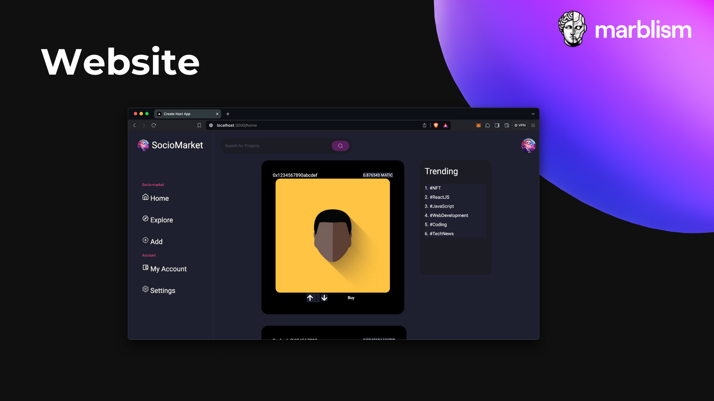

# Socio-Marketo

Socio-Marketo is a decentralized social media platform that leverages blockchain technology to provide users with ownership and authenticity of their content. This repository contains the codebase for Socio-Marketo, including the smart contracts, web application built with Next.js, and mobile application built with Expo React Native.

## Folder Structure

The repository is organized as follows:

- **/smart_contracts**: Contains the Solidity smart contracts for Socio-Marketo.
- **/web**: Contains the web application frontend code, developed using Next.js.
- **/mobile**: Contains the mobile application frontend code, developed using Expo React Native.
- **/jupyter_notebooks**: Contains Jupyter notebooks for data analysis and research related to Socio-Marketo.

## Smart Contracts

The smart contracts are written in Solidity and deployed on the Ethereum blockchain. They govern the core functionality of Socio-Marketo, including tokenization of user-generated posts as Non-Fungible Tokens (NFTs), user authentication, and content verification.

## Web Application

The web application frontend is developed using Next.js, a React framework for building server-side rendered (SSR) and statically generated applications. It provides users with a seamless and intuitive interface for interacting with Socio-Marketo, including browsing posts, creating content, and managing their profile.

## Mobile Application

The mobile application frontend is developed using Expo React Native, a framework for building cross-platform mobile applications with React Native. It offers users the flexibility to access Socio-Marketo from their smartphones, with features tailored for a mobile experience, such as push notifications and camera integration.

## Jupyter Notebooks

The Jupyter notebooks in this folder are used for data analysis, research, and experimentation related to Socio-Marketo. They cover topics such as user engagement metrics, content trends, and blockchain integration strategies.

## Getting Started

To get started with Socio-Marketo, follow the setup instructions in each respective folder (`/smart_contracts`, `/web`, `/mobile`). Make sure to install the necessary dependencies and configure any environment variables required for deployment and testing.

## Working Images

---
